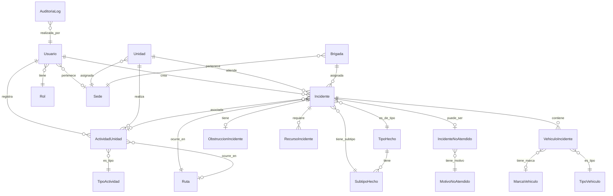

# Diseño de Base de Datos - Sistema Provial Integral

## Diagrama Entidad-Relación (Mermaid)



## 1. Módulo de Autenticación y Usuarios

### Tabla: `rol`
| Campo | Tipo | Restricciones | Descripción |
|-------|------|---------------|-------------|
| id | SERIAL | PK | Identificador único |
| nombre | VARCHAR(50) | UNIQUE, NOT NULL | Nombre del rol |
| descripcion | TEXT | - | Descripción del rol |
| permisos | JSONB | NOT NULL, DEFAULT '{}' | Permisos específicos del rol |
| created_at | TIMESTAMPTZ | DEFAULT NOW() | Fecha de creación |

**Valores iniciales:**
- ADMIN: Control total del sistema
- COP: Operadores del centro de operaciones
- BRIGADA: Personal en campo
- OPERACIONES: Departamento de operaciones
- ACCIDENTOLOGIA: Departamento de accidentología
- MANDOS: Jefes y supervisores
- PUBLICO: Usuarios ciudadanos (reportes públicos)

### Tabla: `sede`
| Campo | Tipo | Restricciones | Descripción |
|-------|------|---------------|-------------|
| id | SERIAL | PK | Identificador único |
| codigo | VARCHAR(20) | UNIQUE, NOT NULL | Código de la sede (ej: "GUA-01") |
| nombre | VARCHAR(100) | NOT NULL | Nombre de la sede |
| departamento | VARCHAR(50) | - | Departamento donde se ubica |
| municipio | VARCHAR(50) | - | Municipio |
| direccion | TEXT | - | Dirección completa |
| telefono | VARCHAR(20) | - | Teléfono de contacto |
| activa | BOOLEAN | DEFAULT TRUE | Si la sede está operativa |
| created_at | TIMESTAMPTZ | DEFAULT NOW() | Fecha de creación |

### Tabla: `usuario`
| Campo | Tipo | Restricciones | Descripción |
|-------|------|---------------|-------------|
| id | SERIAL | PK | Identificador único |
| uuid | UUID | UNIQUE, DEFAULT uuid_generate_v4() | UUID para referencias externas |
| username | VARCHAR(50) | UNIQUE, NOT NULL | Nombre de usuario |
| password_hash | VARCHAR(255) | NOT NULL | Hash bcrypt de contraseña |
| nombre_completo | VARCHAR(150) | NOT NULL | Nombre completo |
| email | VARCHAR(100) | UNIQUE | Email (opcional) |
| telefono | VARCHAR(20) | - | Teléfono de contacto |
| rol_id | INT | FK(rol.id), NOT NULL | Rol del usuario |
| sede_id | INT | FK(sede.id) | Sede asignada |
| activo | BOOLEAN | DEFAULT TRUE | Si el usuario puede acceder |
| ultimo_acceso | TIMESTAMPTZ | - | Última vez que inició sesión |
| created_at | TIMESTAMPTZ | DEFAULT NOW() | Fecha de creación |
| updated_at | TIMESTAMPTZ | DEFAULT NOW() | Última actualización |

**Índices:**
- `idx_usuario_username` ON username
- `idx_usuario_rol` ON rol_id
- `idx_usuario_sede` ON sede_id

---

## 2. Módulo de Unidades y Brigadas

### Tabla: `unidad`
| Campo | Tipo | Restricciones | Descripción |
|-------|------|---------------|-------------|
| id | SERIAL | PK | Identificador único |
| codigo | VARCHAR(20) | UNIQUE, NOT NULL | Código de la unidad (ej: "PROV-01") |
| tipo_unidad | VARCHAR(50) | NOT NULL | Tipo: MOTORIZADA, PICKUP, PATRULLA |
| marca | VARCHAR(50) | - | Marca del vehículo |
| modelo | VARCHAR(50) | - | Modelo |
| anio | INT | - | Año |
| placa | VARCHAR(20) | - | Placa |
| sede_id | INT | FK(sede.id), NOT NULL | Sede asignada |
| activa | BOOLEAN | DEFAULT TRUE | Si está operativa |
| created_at | TIMESTAMPTZ | DEFAULT NOW() | Fecha de creación |
| updated_at | TIMESTAMPTZ | DEFAULT NOW() | Última actualización |

**Índices:**
- `idx_unidad_codigo` ON codigo
- `idx_unidad_sede` ON sede_id

### Tabla: `brigada`
| Campo | Tipo | Restricciones | Descripción |
|-------|------|---------------|-------------|
| id | SERIAL | PK | Identificador único |
| codigo | VARCHAR(20) | UNIQUE, NOT NULL | Código de brigada (ej: "BRIG-A1") |
| nombre | VARCHAR(100) | NOT NULL | Nombre de la brigada |
| sede_id | INT | FK(sede.id), NOT NULL | Sede asignada |
| activa | BOOLEAN | DEFAULT TRUE | Si está operativa |
| created_at | TIMESTAMPTZ | DEFAULT NOW() | Fecha de creación |

**Índices:**
- `idx_brigada_codigo` ON codigo
- `idx_brigada_sede` ON sede_id

---

## 3. Módulo de Catálogos

### Tabla: `ruta`
| Campo | Tipo | Restricciones | Descripción |
|-------|------|---------------|-------------|
| id | SERIAL | PK | Identificador único |
| codigo | VARCHAR(20) | UNIQUE, NOT NULL | Código (ej: "CA-9") |
| nombre | VARCHAR(150) | NOT NULL | Nombre completo |
| tipo_ruta | VARCHAR(30) | - | CARRETERA, AUTOPISTA, BOULEVARD |
| km_inicial | DECIMAL(6,2) | - | Kilometraje inicial |
| km_final | DECIMAL(6,2) | - | Kilometraje final |
| activa | BOOLEAN | DEFAULT TRUE | Si está en uso |
| created_at | TIMESTAMPTZ | DEFAULT NOW() | Fecha de creación |

**Índices:**
- `idx_ruta_codigo` ON codigo

### Tabla: `tipo_hecho`
| Campo | Tipo | Restricciones | Descripción |
|-------|------|---------------|-------------|
| id | SERIAL | PK | Identificador único |
| nombre | VARCHAR(100) | UNIQUE, NOT NULL | Nombre del tipo de hecho |
| icono | VARCHAR(50) | - | Nombre del ícono para UI |
| color | VARCHAR(7) | - | Color hex para mapas |
| activo | BOOLEAN | DEFAULT TRUE | Si está en uso |
| created_at | TIMESTAMPTZ | DEFAULT NOW() | Fecha de creación |

**Valores iniciales:**
- Accidente Vial
- Vehículo Varado
- Derrumbe
- Árbol Caído
- Trabajos en la Vía
- Manifestación
- Regulación de Tránsito
- Otro

### Tabla: `subtipo_hecho`
| Campo | Tipo | Restricciones | Descripción |
|-------|------|---------------|-------------|
| id | SERIAL | PK | Identificador único |
| tipo_hecho_id | INT | FK(tipo_hecho.id), NOT NULL | Tipo padre |
| nombre | VARCHAR(100) | NOT NULL | Nombre del subtipo |
| activo | BOOLEAN | DEFAULT TRUE | Si está en uso |
| created_at | TIMESTAMPTZ | DEFAULT NOW() | Fecha de creación |

**Ejemplos:**
- Accidente Vial → Colisión, Volcamiento, Atropello, Salida de vía
- Vehículo Varado → Falla mecánica, Sin combustible, Llanta ponchada

**Índices:**
- `idx_subtipo_tipo` ON tipo_hecho_id

### Tabla: `tipo_vehiculo`
| Campo | Tipo | Restricciones | Descripción |
|-------|------|---------------|-------------|
| id | SERIAL | PK | Identificador único |
| nombre | VARCHAR(50) | UNIQUE, NOT NULL | Tipo de vehículo |
| categoria | VARCHAR(30) | - | LIVIANO, PESADO, MOTO |
| created_at | TIMESTAMPTZ | DEFAULT NOW() | Fecha de creación |

**Valores iniciales:**
- Automóvil, Pickup, Panel, Motocicleta, Bus, Microbús, Camión, Cabezal, Rastra, Otro

### Tabla: `marca_vehiculo`
| Campo | Tipo | Restricciones | Descripción |
|-------|------|---------------|-------------|
| id | SERIAL | PK | Identificador único |
| nombre | VARCHAR(50) | UNIQUE, NOT NULL | Marca |
| created_at | TIMESTAMPTZ | DEFAULT NOW() | Fecha de creación |

### Tabla: `tipo_actividad`
| Campo | Tipo | Restricciones | Descripción |
|-------|------|---------------|-------------|
| id | SERIAL | PK | Identificador único |
| nombre | VARCHAR(100) | UNIQUE, NOT NULL | Tipo de actividad |
| requiere_incidente | BOOLEAN | DEFAULT FALSE | Si debe estar asociado a incidente |
| color | VARCHAR(7) | - | Color para UI |
| created_at | TIMESTAMPTZ | DEFAULT NOW() | Fecha de creación |

**Valores iniciales:**
- Patrullaje (requiere_incidente: false)
- Accidente Vial (requiere_incidente: true)
- Regulación de Tránsito (requiere_incidente: true)
- Almuerzo (requiere_incidente: false)
- Parada Estratégica (requiere_incidente: false)
- Carga de Combustible (requiere_incidente: false)
- Fuera de Servicio (requiere_incidente: false)
- Mantenimiento (requiere_incidente: false)

### Tabla: `motivo_no_atendido`
| Campo | Tipo | Restricciones | Descripción |
|-------|------|---------------|-------------|
| id | SERIAL | PK | Identificador único |
| nombre | VARCHAR(100) | UNIQUE, NOT NULL | Motivo |
| descripcion | TEXT | - | Descripción detallada |
| requiere_observaciones | BOOLEAN | DEFAULT FALSE | Si se debe justificar |
| activo | BOOLEAN | DEFAULT TRUE | Si está en uso |
| created_at | TIMESTAMPTZ | DEFAULT NOW() | Fecha de creación |

**Valores iniciales:**
- Sin Combustible
- Fuera de Jurisdicción
- Unidad No Disponible
- Falsa Alarma
- Ya Atendido por Otra Institución
- Riesgo para la Unidad
- Fuera de Competencia
- Otro (requiere_observaciones: true)

---

## 4. Módulo de Incidentes (CORE)

### Tabla: `incidente`
| Campo | Tipo | Restricciones | Descripción |
|-------|------|---------------|-------------|
| id | BIGSERIAL | PK | Identificador único |
| uuid | UUID | UNIQUE, DEFAULT uuid_generate_v4() | UUID para referencias externas |
| numero_reporte | VARCHAR(50) | UNIQUE, GENERATED | Número legible (ej: "INC-2025-0001") |
| origen | VARCHAR(30) | NOT NULL | BRIGADA, USUARIO_PUBLICO, CENTRO_CONTROL |
| estado | VARCHAR(30) | NOT NULL, DEFAULT 'REPORTADO' | REPORTADO, EN_ATENCION, REGULACION, CERRADO, NO_ATENDIDO |
| tipo_hecho_id | INT | FK(tipo_hecho.id), NOT NULL | Tipo de hecho |
| subtipo_hecho_id | INT | FK(subtipo_hecho.id) | Subtipo específico |
| ruta_id | INT | FK(ruta.id), NOT NULL | Ruta donde ocurrió |
| km | DECIMAL(6,2) | NOT NULL | Kilometraje |
| sentido | VARCHAR(30) | - | NORTE, SUR, ESTE, OESTE, ASCENDENTE, DESCENDENTE |
| referencia_ubicacion | TEXT | - | Descripción adicional de ubicación |
| latitud | DECIMAL(10,8) | - | Coordenada GPS |
| longitud | DECIMAL(11,8) | - | Coordenada GPS |
| unidad_id | INT | FK(unidad.id) | Unidad asignada |
| brigada_id | INT | FK(brigada.id) | Brigada asignada |
| fecha_hora_aviso | TIMESTAMPTZ | NOT NULL | Cuando se recibió el aviso |
| fecha_hora_asignacion | TIMESTAMPTZ | - | Cuando se asignó a unidad |
| fecha_hora_llegada | TIMESTAMPTZ | - | Cuando llegó la unidad |
| fecha_hora_estabilizacion | TIMESTAMPTZ | - | Cuando se estabilizó la situación |
| fecha_hora_finalizacion | TIMESTAMPTZ | - | Cuando finalizó el procedimiento |
| hay_heridos | BOOLEAN | DEFAULT FALSE | Si hay personas heridas |
| cantidad_heridos | INT | DEFAULT 0 | Número de heridos |
| hay_fallecidos | BOOLEAN | DEFAULT FALSE | Si hay fallecidos |
| cantidad_fallecidos | INT | DEFAULT 0 | Número de fallecidos |
| requiere_bomberos | BOOLEAN | DEFAULT FALSE | Si se solicitó bomberos |
| requiere_pnc | BOOLEAN | DEFAULT FALSE | Si se solicitó PNC |
| requiere_ambulancia | BOOLEAN | DEFAULT FALSE | Si se solicitó ambulancia |
| observaciones_iniciales | TEXT | - | Observaciones al reportar |
| observaciones_finales | TEXT | - | Observaciones al cerrar |
| condiciones_climaticas | VARCHAR(50) | - | Para accidentología |
| tipo_pavimento | VARCHAR(50) | - | Para accidentología |
| iluminacion | VARCHAR(50) | - | Para accidentología |
| senalizacion | VARCHAR(50) | - | Para accidentología |
| visibilidad | VARCHAR(50) | - | Para accidentología |
| causa_probable | TEXT | - | Para accidentología |
| reportado_por_nombre | VARCHAR(150) | - | Si es reporte público |
| reportado_por_telefono | VARCHAR(20) | - | Si es reporte público |
| reportado_por_email | VARCHAR(100) | - | Si es reporte público |
| foto_url | TEXT | - | URL de foto (si hay) |
| creado_por | INT | FK(usuario.id), NOT NULL | Usuario que creó |
| actualizado_por | INT | FK(usuario.id) | Último usuario que actualizó |
| created_at | TIMESTAMPTZ | DEFAULT NOW() | Fecha de creación |
| updated_at | TIMESTAMPTZ | DEFAULT NOW() | Última actualización |

**Índices:**
- `idx_incidente_uuid` ON uuid
- `idx_incidente_numero` ON numero_reporte
- `idx_incidente_estado` ON estado
- `idx_incidente_origen` ON origen
- `idx_incidente_fecha_aviso` ON fecha_hora_aviso
- `idx_incidente_ruta_km` ON (ruta_id, km)
- `idx_incidente_unidad` ON unidad_id
- `idx_incidente_created_at` ON created_at

**Trigger para generar numero_reporte:**
```sql
-- Formato: INC-2025-0001, INC-2025-0002, etc.
```

### Tabla: `vehiculo_incidente`
| Campo | Tipo | Restricciones | Descripción |
|-------|------|---------------|-------------|
| id | BIGSERIAL | PK | Identificador único |
| incidente_id | BIGINT | FK(incidente.id) ON DELETE CASCADE, NOT NULL | Incidente asociado |
| tipo_vehiculo_id | INT | FK(tipo_vehiculo.id) | Tipo de vehículo |
| marca_id | INT | FK(marca_vehiculo.id) | Marca |
| modelo | VARCHAR(50) | - | Modelo |
| anio | INT | - | Año |
| color | VARCHAR(30) | - | Color |
| placa | VARCHAR(20) | - | Placa |
| estado_piloto | VARCHAR(30) | - | ILESO, HERIDO, FALLECIDO, TRASLADADO, HUYÓ |
| nombre_piloto | VARCHAR(150) | - | Nombre del conductor |
| licencia_piloto | VARCHAR(50) | - | Número de licencia |
| heridos_en_vehiculo | INT | DEFAULT 0 | Cantidad de heridos |
| fallecidos_en_vehiculo | INT | DEFAULT 0 | Cantidad de fallecidos |
| danos_estimados | VARCHAR(50) | - | LEVE, MODERADO, GRAVE, PERDIDA_TOTAL |
| observaciones | TEXT | - | Observaciones del vehículo |
| created_at | TIMESTAMPTZ | DEFAULT NOW() | Fecha de creación |

**Índices:**
- `idx_vehiculo_incidente` ON incidente_id

### Tabla: `obstruccion_incidente`
| Campo | Tipo | Restricciones | Descripción |
|-------|------|---------------|-------------|
| id | BIGSERIAL | PK | Identificador único |
| incidente_id | BIGINT | FK(incidente.id) ON DELETE CASCADE, NOT NULL, UNIQUE | Incidente (relación 1:1) |
| descripcion_generada | TEXT | - | Texto auto-generado de obstrucción |
| datos_carriles_json | JSONB | NOT NULL, DEFAULT '{}' | Estado detallado de carriles |
| created_at | TIMESTAMPTZ | DEFAULT NOW() | Fecha de creación |
| updated_at | TIMESTAMPTZ | DEFAULT NOW() | Última actualización |

**Estructura de datos_carriles_json:**
```json
{
  "norte": {
    "totalCarriles": 2,
    "carrilObstruido": 1,
    "carrilHabilitado": 2,
    "flujo": "DETENIDO" | "LENTO" | "FLUIDO"
  },
  "sur": { ... },
  "este": { ... },
  "oeste": { ... }
}
```

### Tabla: `recurso_incidente`
| Campo | Tipo | Restricciones | Descripción |
|-------|------|---------------|-------------|
| id | BIGSERIAL | PK | Identificador único |
| incidente_id | BIGINT | FK(incidente.id) ON DELETE CASCADE, NOT NULL | Incidente asociado |
| tipo_recurso | VARCHAR(50) | NOT NULL | GRUA, BOMBEROS, PNC, AMBULANCIA, AJUSTADOR |
| descripcion | TEXT | - | Descripción del recurso |
| hora_solicitud | TIMESTAMPTZ | - | Cuando se solicitó |
| hora_llegada | TIMESTAMPTZ | - | Cuando llegó |
| observaciones | TEXT | - | Observaciones |
| created_at | TIMESTAMPTZ | DEFAULT NOW() | Fecha de creación |

**Índices:**
- `idx_recurso_incidente` ON incidente_id

### Tabla: `incidente_no_atendido`
| Campo | Tipo | Restricciones | Descripción |
|-------|------|---------------|-------------|
| id | BIGSERIAL | PK | Identificador único |
| incidente_id | BIGINT | FK(incidente.id) ON DELETE CASCADE, NOT NULL, UNIQUE | Incidente (relación 1:1) |
| motivo_id | INT | FK(motivo_no_atendido.id), NOT NULL | Motivo |
| observaciones | TEXT | - | Justificación adicional |
| registrado_por | INT | FK(usuario.id), NOT NULL | Usuario que registró |
| created_at | TIMESTAMPTZ | DEFAULT NOW() | Fecha de creación |

---

## 5. Módulo de Actividades de Unidades

### Tabla: `actividad_unidad`
| Campo | Tipo | Restricciones | Descripción |
|-------|------|---------------|-------------|
| id | BIGSERIAL | PK | Identificador único |
| unidad_id | INT | FK(unidad.id), NOT NULL | Unidad que realiza la actividad |
| tipo_actividad_id | INT | FK(tipo_actividad.id), NOT NULL | Tipo de actividad |
| incidente_id | BIGINT | FK(incidente.id) | Incidente asociado (si aplica) |
| ruta_id | INT | FK(ruta.id) | Ruta donde se encuentra |
| km | DECIMAL(6,2) | - | Kilometraje |
| sentido | VARCHAR(30) | - | Sentido |
| hora_inicio | TIMESTAMPTZ | NOT NULL | Inicio de la actividad |
| hora_fin | TIMESTAMPTZ | - | Fin de la actividad (NULL si está activa) |
| observaciones | TEXT | - | Observaciones |
| registrado_por | INT | FK(usuario.id), NOT NULL | Usuario que registró |
| created_at | TIMESTAMPTZ | DEFAULT NOW() | Fecha de creación |
| updated_at | TIMESTAMPTZ | DEFAULT NOW() | Última actualización |

**Índices:**
- `idx_actividad_unidad` ON unidad_id
- `idx_actividad_fecha` ON hora_inicio
- `idx_actividad_tipo` ON tipo_actividad_id
- `idx_actividad_activa` ON (unidad_id, hora_fin) WHERE hora_fin IS NULL

**Constraint:**
```sql
-- Una unidad solo puede tener UNA actividad activa (hora_fin NULL) a la vez
CREATE UNIQUE INDEX idx_unidad_actividad_activa
ON actividad_unidad (unidad_id)
WHERE hora_fin IS NULL;
```

---

## 6. Módulo de Auditoría

### Tabla: `auditoria_log`
| Campo | Tipo | Restricciones | Descripción |
|-------|------|---------------|-------------|
| id | BIGSERIAL | PK | Identificador único |
| usuario_id | INT | FK(usuario.id) | Usuario que realizó la acción |
| accion | VARCHAR(50) | NOT NULL | INSERT, UPDATE, DELETE, LOGIN, LOGOUT |
| tabla_afectada | VARCHAR(100) | - | Nombre de la tabla |
| registro_id | BIGINT | - | ID del registro afectado |
| datos_anteriores | JSONB | - | Estado antes del cambio |
| datos_nuevos | JSONB | - | Estado después del cambio |
| ip_address | VARCHAR(45) | - | IP del usuario |
| user_agent | TEXT | - | Navegador/app |
| created_at | TIMESTAMPTZ | DEFAULT NOW() | Fecha de la acción |

**Índices:**
- `idx_auditoria_usuario` ON usuario_id
- `idx_auditoria_tabla` ON tabla_afectada
- `idx_auditoria_created` ON created_at

---

## 7. Estadísticas y Métricas (Vistas Materializadas)

### Vista Materializada: `mv_estadisticas_diarias`
```sql
CREATE MATERIALIZED VIEW mv_estadisticas_diarias AS
SELECT
    DATE(fecha_hora_aviso) as fecha,
    ruta_id,
    tipo_hecho_id,
    origen,
    estado,
    COUNT(*) as total_incidentes,
    SUM(cantidad_heridos) as total_heridos,
    SUM(cantidad_fallecidos) as total_fallecidos,
    AVG(EXTRACT(EPOCH FROM (fecha_hora_llegada - fecha_hora_aviso))/60) as tiempo_respuesta_promedio_min,
    AVG(EXTRACT(EPOCH FROM (fecha_hora_finalizacion - fecha_hora_llegada))/60) as tiempo_atencion_promedio_min
FROM incidente
WHERE fecha_hora_aviso >= CURRENT_DATE - INTERVAL '90 days'
GROUP BY DATE(fecha_hora_aviso), ruta_id, tipo_hecho_id, origen, estado;

CREATE UNIQUE INDEX idx_mv_estadisticas ON mv_estadisticas_diarias (fecha, ruta_id, tipo_hecho_id, origen, estado);
```

**Refresh:** Ejecutar cada noche a las 00:30 (cron job)

---

## 8. Constraints y Reglas de Negocio

### Checks
```sql
-- Incidente: Si hay heridos/fallecidos, la cantidad debe ser > 0
ALTER TABLE incidente ADD CONSTRAINT chk_heridos
CHECK ((hay_heridos = FALSE AND cantidad_heridos = 0) OR (hay_heridos = TRUE AND cantidad_heridos > 0));

ALTER TABLE incidente ADD CONSTRAINT chk_fallecidos
CHECK ((hay_fallecidos = FALSE AND cantidad_fallecidos = 0) OR (hay_fallecidos = TRUE AND cantidad_fallecidos > 0));

-- Incidente: fecha_hora_llegada >= fecha_hora_aviso
ALTER TABLE incidente ADD CONSTRAINT chk_fechas_cronologicas
CHECK (
    fecha_hora_llegada IS NULL OR fecha_hora_llegada >= fecha_hora_aviso
);

-- ActividadUnidad: hora_fin >= hora_inicio
ALTER TABLE actividad_unidad ADD CONSTRAINT chk_actividad_tiempos
CHECK (hora_fin IS NULL OR hora_fin >= hora_inicio);

-- Incidente: KM dentro del rango de la ruta
-- (Se validará en backend con JOIN a tabla ruta)
```

### Triggers
```sql
-- Auto-actualizar updated_at en tablas relevantes
CREATE OR REPLACE FUNCTION update_updated_at_column()
RETURNS TRIGGER AS $$
BEGIN
    NEW.updated_at = NOW();
    RETURN NEW;
END;
$$ language 'plpgsql';

CREATE TRIGGER update_incidente_updated_at BEFORE UPDATE ON incidente
FOR EACH ROW EXECUTE FUNCTION update_updated_at_column();

-- Generar numero_reporte automático
CREATE OR REPLACE FUNCTION generar_numero_reporte()
RETURNS TRIGGER AS $$
DECLARE
    anio INT;
    secuencia INT;
BEGIN
    anio := EXTRACT(YEAR FROM NEW.fecha_hora_aviso);

    SELECT COALESCE(MAX(CAST(SUBSTRING(numero_reporte FROM 'INC-\d{4}-(\d+)') AS INT)), 0) + 1
    INTO secuencia
    FROM incidente
    WHERE EXTRACT(YEAR FROM fecha_hora_aviso) = anio;

    NEW.numero_reporte := 'INC-' || anio || '-' || LPAD(secuencia::TEXT, 4, '0');
    RETURN NEW;
END;
$$ language 'plpgsql';

CREATE TRIGGER trigger_generar_numero_reporte BEFORE INSERT ON incidente
FOR EACH ROW EXECUTE FUNCTION generar_numero_reporte();

-- Cerrar actividad anterior al abrir nueva para la misma unidad
CREATE OR REPLACE FUNCTION cerrar_actividad_anterior()
RETURNS TRIGGER AS $$
BEGIN
    UPDATE actividad_unidad
    SET hora_fin = NEW.hora_inicio
    WHERE unidad_id = NEW.unidad_id
      AND hora_fin IS NULL
      AND id != NEW.id;
    RETURN NEW;
END;
$$ language 'plpgsql';

CREATE TRIGGER trigger_cerrar_actividad_anterior BEFORE INSERT ON actividad_unidad
FOR EACH ROW EXECUTE FUNCTION cerrar_actividad_anterior();
```

---

## 9. Extensiones Requeridas

```sql
CREATE EXTENSION IF NOT EXISTS "uuid-ossp";  -- Para UUID
CREATE EXTENSION IF NOT EXISTS "pg_trgm";    -- Para búsquedas fuzzy
CREATE EXTENSION IF NOT EXISTS "postgis";    -- Para geolocalización (opcional)
```

---

## 10. Políticas de Retención de Datos

- **Incidentes:** Mantener indefinidamente (valor histórico)
- **ActividadUnidad:** Mantener 2 años, luego archivar a tabla de históricos
- **AuditoriaLog:** Mantener 1 año, luego archivar
- **Vistas Materializadas:** Mantener 90 días

---

## 11. Tamaño Estimado de Base de Datos

**Asumiendo:**
- 86 unidades
- ~50 incidentes/día promedio = 18,250 incidentes/año
- ~500 actividades/día = 182,500 actividades/año

**Estimación de almacenamiento:**
- Incidentes (1 año): ~50 MB
- Vehículos: ~20 MB
- Actividades (1 año): ~100 MB
- Auditoría (1 año): ~80 MB
- **Total año 1:** ~250 MB (muy manejable)

Con 5 años de datos: ~1-2 GB (perfectamente escalable en PostgreSQL)

---

## Siguiente Paso

¿Quieres que genere ahora los scripts SQL de migración listos para ejecutar?
